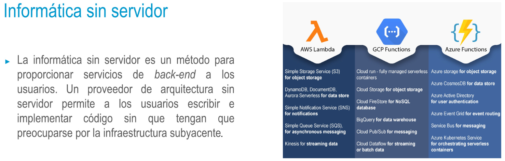

### Aplicaciones móviles y Nube
• Por lo general, en las empresas, las aplicaciones móviles no están aisladas,
diríamos que sirven más bien como front-end a múltiples aplicaciones
empresariales, ya en uso por la empresa. Estas aplicaciones back-end de
empresa pueden variar desde sistemas de procesamiento de transacciones
hasta portales de empleados o sistemas de adquisición de clientes.
• La naturaleza distribuida, remota y de acceso ubicuo la hacen ideal para este
escenario.
• El siguiente gran paso para DevOps es su evolución en los sistemas de
dispositivos embebidos. Cuando comenzó la era de Internet, la mayoría de los
datos compartidos eran generados por humanos. Hoy en día, innumerables
dispositivos conectados a Internet (tales como sensores) generan muchos más
datos que los seres humanos. Esta red de dispositivos interconectados a través
de Internet se conoce comúnmente con el nombre de Internet de las cosas.
- {:height 256, :width 778}
-