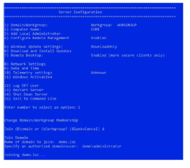

- •Configurar la tarjeta de red del servidor que se va a convertir en controlador de dominio.
  • Fijar el nombre de la máquina antes de promocionarla a controlador de dominio.
  • Añadir el rol de Active Directory Domain Services (desde el Server Manager, en Add roles and features).
  • Una vez terminada la instalación del rol, promocionar el servidor.
  Elegir dónde promocionarle: en dominio existente, en un dominio nuevo en un bosque existente o en un nuevo dominio en un nuevo bosque.
- • Se seleccionan los niveles funcionales del dominio y del bosque.
  • El diálogo ofrece varios servicios disponibles para el controlador de dominio:
  • DNS: que un DC sea un servidor DNS es habitual, pero no necesario.
  • Catálogo Global (GC): es como un buffer que acelera las búsquedas de recursos en AD.
  • Controlador de dominio de solo lectura: ideal para entornos poco seguros que garantice la
  integridad de los datos.
  • Detalles sobre la configuración DNS.
  • Tras el reinicio, el equipo ya actuará como DC del nuevo domino.
- Unión de equipos al dominio
  • Cada nuevo servidor Windows y cada nuevo equipo de cliente debe ser unido al dominio
  para facilitar los inicios de sesión, el control de políticas de seguridad, etc.
  • Se puede usar sconfig. cmd (es una herramienta de configuración de servidores
  que fue creada por Microsoft para configurar y administrar diversos aspectos de las
  instalaciones de Server Core).
- {:height 386, :width 430}
-