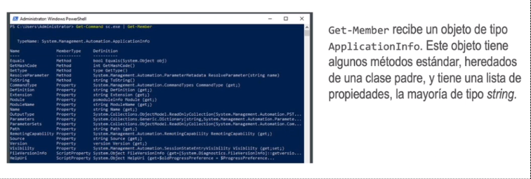
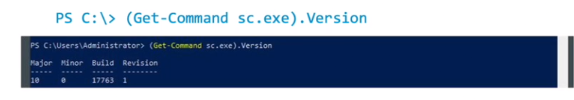
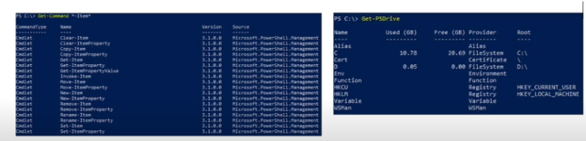
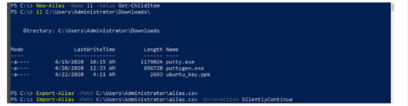

- • Los cmdlets de PowerShell siguen un esquema común de verbo-nombre. El verbo expresa la acción
  que ejecutará el comando sobre un recurso y el nombre describe objetos especificos del SO.
  • El comando Get -Command lista todos los comandos disponibles en un entorno concreto. Es posible
  obtener la lista de comandos que operan sobre un recurso concreto, por ejemplo Process:
- > PS C: \> Get-Command -Noun process
- • Get-Help proporciona ayuda sobre lo que hace un codlet especifico, sus parámetros e incluso incluye
  ejemplos.
- > PS C: |> Get-Help Get-Command -Detailed
- Windows Server 2019 no incluye todos los ficheros de ayuda por defecto. Se pueden descargar con
  Update-Help.
-
- • Prácticamente, todo lo que manipulan los cmdlets son objetos .NET, lo que quiere decir que al enviar la
  salida en una tubería de un comando a otro, el segundo comando recibirá un objeto.
  • Get-Member muestra el detalle de los métodos y atributos del objeto que haya recibido (el comando se se
  utiliza para comunicarse con el controlador de servicio durante las operaciones de línea de comandos):
- {:height 320, :width 761}
-
- • En el ejemplo anterior se ve que el objeto tiene una propiedad versión, por lo que se puede acceder igual que en otros lenguajes de programación:
- 
- Get-PSDrive obtiene las unidades disponibles. Estas unidades pueden manipularse con el mismo
  subconjunto de cmdlets, que se pueden obtener con Get -Command *-Item*
- {:height 212, :width 714}
- #### Alias
- • Los alias son nombres alternativos de comandos y cmdlets para hacer el código más conciso y facilitar la transición de los usuarios de otras shell:
  • Get-Alias muestra la lista de alias definidos en una sesión.
  • Get-Alias ‹ alias› obtiene el comando al que un alias hace referencia.
  • Get-Alias -Definition ‹cmdlet› obtiene los alias definidos para ese cmdlet.
  • New-Alias crea un alias para la sesión actual.
  • Los alias no son permanentes y desaparecen al cerrar la consola, pero se pueden guardar con Export-
  Alias e iniciarlos con Import-Alias.
- {:height 187, :width 763}
-
-