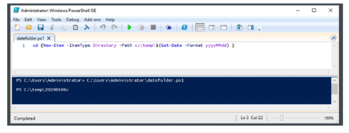
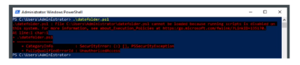

- Los scripts en PowerShell tienen la extensión ps1 y la mayoria de las versiones de Windows incluyen un editor llamado PowerShell ISE, que ofrece autocompletado de los nombres de los comandos y de los parámetros, debugging, coloreado de sintaxis y una interfaz «gráfica».
- {:height 353, :width 760}
-
- Los scripts pueden ejecutarse en el editor o en la línea comandos, aunque es habitual que al hacerlo se muestre un mensaje de error que hace referencia a la execution policy:
- {:height 138, :width 454}
- Se trata de una medida de seguridad para limitar los scripts que se pueden ejecutar:
  • Restricted: no permite la ejecución de scripts en ningún caso.
  • All signed: solo los scripts con una firma digital válida se pueden ejecutar.
  • Remote signed: los scripts de ubicaciones remotas deben tener una firma digital válida para
  ejecutarlos, pero los locales se pueden ejecutar sin restricciones.
  • Unrestricted: cualquier script se puede ejecutar sin restricciones.
  * El comando Get-ExecutionPolicy muestra la política actual, mientras que
  Set-ExecutionPolicy permite cambiar de una política a otra.
- ### Tipos de scripts
  • Una distinción habitual divide los scripts en controladores y herramientas.
  • Los scripts controladores llaman a otros scripts, codlets y funciones para completar su tarea. En
  general no se reusan y se usan habitualmente para el programador de tareas de Windows.
  • Los scripts herramientas ejecutan una única tarea y están pensados para ser reutilizados.
- ### Comentarios
- Comentario en una linea
  Write-Host Hello World
  <#
  comentario en
  multiples lineas
  #>
- ### Ambito de los scripts
- • Cada script se ejecuta en su propio ámbito. Las funciones, variables, alias y unidades que se crean en el script solo existen en el ámbito del script.
  • La característica dot sourcing permite ejecutar un script en el ámbito actual en lugar de en el ámbito del script. Cuando se ejecuta un script con dot sourcing, los comandos del script se ejecutan como si los hubiera escrito en el símbolo del sistema. Las funciones, variables, alias y unidades que crea el script se crean en el ámbito en el que está trabajando. Una vez que se ejecuta el script, se puede usar los elementos creados y acceder a sus valores en la sesión.
- > PS C:\> . .\hello-world.ps1
- ### Parámetros
- • PowerShell soporta la definición de múltiples parámetros, el tipo, los valores por defecto y la
  obligatoriedad.
  • Esta funcionalidad es nativa de PowerShell, por lo que el parseo se hace de forma nativa.
  • PoweShell incluye validaciones de tipo, obligatoriedad..., pero se pueden añadir validaciones extra
  necesarias para nuestro script, por ejemplo que el integer esté dentro de un rango, etc.
- > Param(
  [Parameter (Mandatory=$true)]
  [string] $Var1,
  [Parameter (Mandatory=$false)]
  [Int32] $Var2=42
  TRISTALACESE
- ### Funciones
- • PowerShell soporta la definición de funciones. Cualquier línea de código que se pueda escribir en un script se puede escribir en una función.
  • Las funciones permiten reusar código y facilitan su mantenimiento.
- > function Write-Vars 1
  Param(
  [Parameter (Mandatory=$true)]
  [string] $Var1,
  [Parameter (Mandatory=$false)]
  [Int32] $Var2=42
  Write-Host "Var1 contiene:" $Var1
  Write-Host "Var2 contiene:" $Var2
- • Si el script (que contiene la función) se ejecuta con un dot-source, la función estará disponible en el ámbito de la consola y se podrá ejecutar como un comando más.
- ### Funciones - comentarios
  • PowerShell soporta unos comentarios con un formato
  especial para personalizar la ayuda.
  • Para ellos se utilizan palabras clave como .Synopsis,
  •description, . Inputs, etc. La función del script anterior
  podría quedar:
- > <#
  •Synopsis
  Funcion de ejemplo
  •DESCRIPTION
  Esta funcion imprime los valores de dos parametros..
  • EXAMPLE
  Write-Vars -Var1 "Hello World"
  • EXAMPLE
  Write-Vars -Var1 "Hello World" -Var2 53
  INPUTS
  No espera datos por la entrada estandar.
  . OUTPUTS
  Emite el parametro Var2 por la salida estandar.
  #>
  function Write-Vars {
  Param (...
-