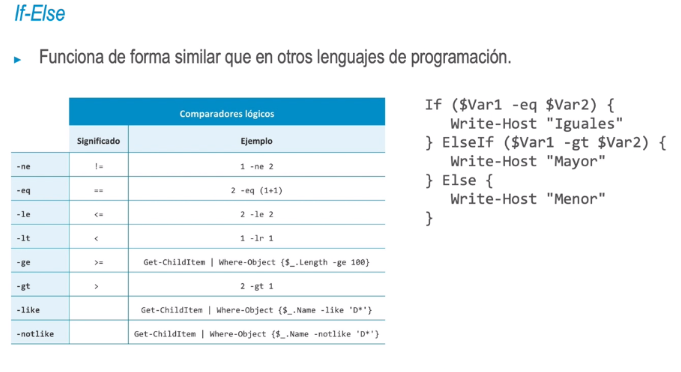

- Bucles
  • La expresión más habitual para recorrer un bucle es ForEach. Esta expresión ejecuta un bloque de
  código para todos los valores de una colección.
- • Este bloque imprime el nombre de todos los ficheros de una carpeta:
- > ForEach ($file in (Get-ChildItem -Path C: \Users\Administrator -File)) {
  Write-Host $file.Name
  }
- No es necesario inicializar la variable si ForEach recibe la colección a través de una tubería. En ese
  caso, la variable $_ contiene el valor de cada iteración:
- > Get-ChildItem -Path C: \Users\Administrator -File | ForEach {
  Write-Host $_. Name
  }
- 
- ### Bucles
  • La expresión hi le funciona como en otros lenguajes de programación
- > $i = 1
  While ($i -le 5) {
  Write-Host $i
  $i = $i + 1
  }
- For igualmente no varia su sintaxis respecto a otros lenguajes:
- > For (#j=1; $j -le 5; $j++)
  {
  Write-Host $j
  }
- ### Tuberías
  Las tuberías permiten transferir objetos .NET entre comandos. Al ser objetos, se pueden utilizar cmdlets específicos:
  • Sort-Object facilita la ordenación de una colección a partir de atributos arbitrarios de los objetos.
  • Where-Object se usa para filtrar listas a partir de los atributos de los objetos.
  • Select-Object se puede usar con dos objetivos: limitar el número de objetos de la colección y limitar las propiedades de estos objetos. La limitación en el número de objetos no es un filtrado como el de Where-Object, sino un truncado de la lista para obtener los primeros diez elementos o los diez últimos, por ejemplo.
- > PS C:\> Get-ChildItem -Path C:\Users\Administrator -File | Sort-Object -Property
  Length -Descending | Select-Object -First 2 -Skip 1
- Directory: C:\Users\Administrator
  Mode
  -a-- --
  -a----
  LastWriteTime
  4/20/2020 12:37 AM
  5/7/2020 2:53 AM
  Length Name
  2693 security_key-ppk
  1148 hello-world. ps1