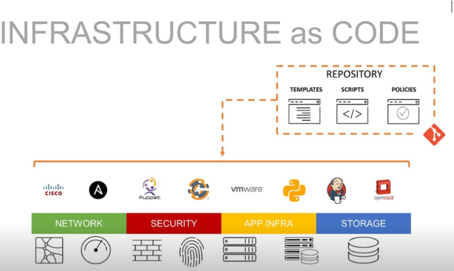

## ¿Qué es la laC?
• En 2011, Andressen Marc escribió un artículo llamado «Why Software is Eating the World». La idea central de este artículo está en que cualquier proceso que puede ser programado se convierte en software.
- {:height 459, :width 754}
-
- ## Infraestructura como código
  • La infraestructura como código (laC) es un enfoque para la gestión de infraestructuras de sistemas de
  Ti que se basa en el uso de archivos de configuración repetibles para generar entornos de implementación consistentes para el desarrollo de CI/CD.
- • La infraestructura como código (laC) es un enfoque para la gestión de infraestructuras de sistemas de
  TI que se basa en el uso de archivos de configuración repetibles para generar entornos e
  implementación consistentes para el desarrollo de CI/CD.
  • La infraestructura como código (en siglas, laC) trata la infraestructura de sistemas como un software y
  en consecuencia, adquiere muchas de las ventajas del desarrollo de software, incluyendo, por supuesto:
  • Automatización.
  • Repetibilidad.
  • Predictibilidad.
  • Trazabilidad
- • Versionado.
-