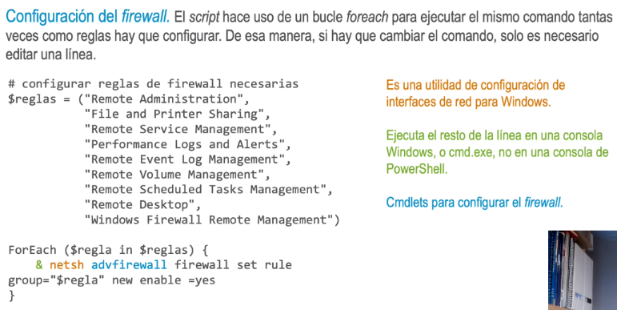
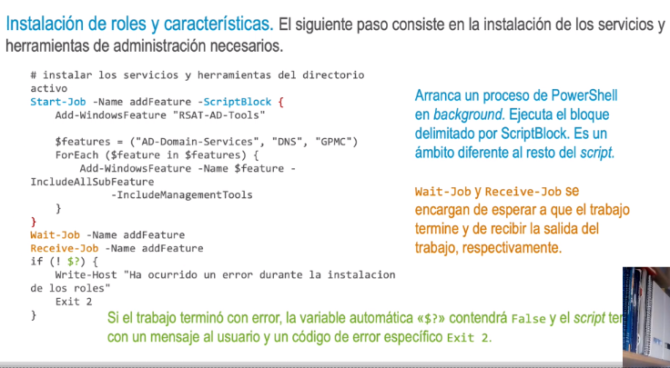
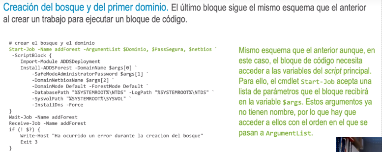

- • El objetivo es automatizar la instalación del Directorio Activo.
  • Al ser un componente crítico, se podría considerar peligroso o inútil la automatización. Pero hay
  argumentos que defienden lo contrario:
  • Aunque se use poco, un script de este tipo puede agilizar la creación de entornos de prueba.
  • Con la automatización se reduce el error humano.
  • Con un script podemos hacer verificaciones que en la interfaz gráfica no existen.
- Ayuda interactiva. Get-Help mostrará la ayuda al pasar el nombre del script como parámetro:
  Get-Help • install.ps1 - Detailed.
- > <#
  • SYNOPSIS
  Script de creacion de dominio
  . DESCRIPTION
  Este script instalara los roles y caracteristicas de Windows
  necesarias para que el servidor funcione como un controlador de dominio. A continuacion creara un bosque con un
  dominio y reiniciara el equipo. Tambien configurara el firewall para permitir el trafico relacionado con AD.
  •PARAMETER Dominio
  El nombre del nuevo dominio
  . PARAMETER Dns1
  La IP del servidor DNS primario
  •PARAMETER Dns2
  La IP del servidor DNS secundario
  •PARAMETER Password
  La contraseña que se establecera para el usuario Administrator en el directorio activo (AD) •
  . INPUTS
  No espera datos por la entrada estandar.
  . OUTPUTS
  No devuelve datos por la salida estandar.
  • EXAMPLE
  PS C:/›instalar-ad.ps1 -dominio demo.loc -dns1 8.8.8.8 -dns2 8.8.4.4 -password secreto
  . NOTES
-
- ### Parámetros.
- PowerShell ofrece una funcionalidad integrada para el «parseo» de parámetros.
- > param (
  [string]$Dominio = "demo.loc",
  [string]$Dns1 = "8.8.8.8"
  [string]$Dns2 = "8.8.4.4",
  [Parameter (Mandatory=$true)][string]$Password
- Dividimos el parámetro $dominio entre los puntos de la cadena de texto de manera que, si el $dominio
  es «demo. loc», $componentes es una lista con dos cadenas, «demo» y «loc».
- inicializar y verificar los componentes del nombre de dominio
- > $componentes = $Dominio.Split(".")
  If ($componentes.Length -ne 2) {
  Write-Host "El nombre de dominio debe tener el formato NOMBRE .SUFIJO"
  exit 3
  }
- El nombre del dominio completo es necesario tal cual, pero, en algunos casos, es necesario usar los
  componentes por separado. Además, las contraseñas deben almacenarse como un objeto SecureString.
- > §netbios, $suffix = $componentes [®], $componentes [1]
- guardar la contraseña como un objeto seguro
- > $PassSegura = ConvertTo-SecureString -String "$Password" •
  -AsPlainText -Force
- Cambio de la contraseña local. Este paso modifica la contraseña del administrador al valor introducido
  como parámetro. La cuenta de administrador local se convertirá en administrador del dominio, por lo que este paso es parte de la configuración de AD.
- Cambiar la contraseña del administrador
- > $admin = [adsi] ('WinNT:// •/administrator, user')
  $admin.psbase.invoke('SetPassword', $Password)
- La interfaz COM (interfaz de intercambio de objetos entre procesos propia de Microsoft) del script es ADSI Aunque está pensada para acceder a objetos de AD, en este caso se conecta al equipo local (en este punto del script aún no se ha creado el dominio). La cadena "WinNT: // ./administrator" indica una conexión al objeto administrator del equipo local, identificado por un «.».
-
- 
- Servidores DNS. El script vuelve a hacer uso de netsh para la configuración, pero usa la interfaz wMI para
  recuperar el ID de la tarjeta de red. WMl es una interfaz para la administración de múltiples objetos del sistema
  operativo.
- ### configurar los servidores dns en la NIC
- > §nicConfig = Get-WmiObject Win32_NetworkAdapterConfiguration
  -Filter "ipenabled = 'true'"
  1 Select-Object -First 1
  $nic = Get-WmiObject Win32_NetworkAdapter *
  -Filter "InterfaceIndex = $($nicConfig.InterfaceIndex)"
  & netsh interface ip set dnsservers name="$($nic.NetConnectionID)" •
  source=static address=$Dns1
  & netsh interface ip add dnsservers name="$($nic.NetConnectionID)" •
  address=$Dns2 index=2
- 
-
- 
-