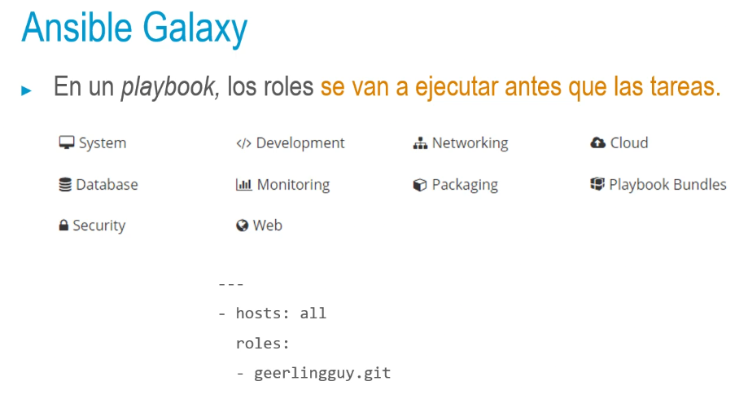
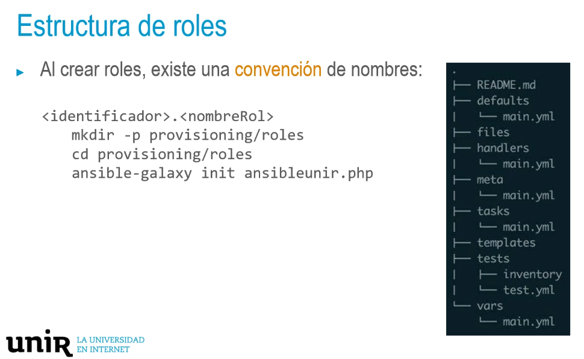
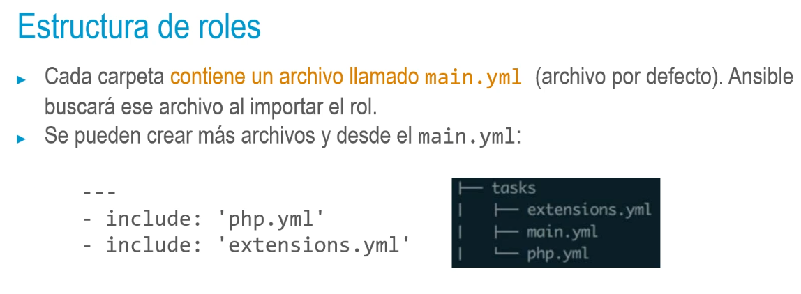

## ¿Qué un rol?
• Roles: mecanismo que nos permite empaquetar las tareas, los manejadores y todos los
demás archivos relacionados en componentes reutilizables que puedes compartir y
reutilizar mediante su inclusión en un playbook.
• Un playbook es un archivo independiente. Un rol podría considerarse como un playbook
que se separa en diferentes archivos que es necesario incluirlo dentro de un playbook con
la información de los hosts donde ejecutarlo.
- ## Ansible Galaxy
  • Ansible Galaxy es el repositorio web donde los usuarios de Ansible pueden subir roles que
  ellos mismos han desarrollado para que otros usuarios a su vez puedan descargarlos y
  utilizarlos. https://galaxy.ansible.com/
  • Como puede ocurrir con cualquier repositorio público, podemos encontrar contribuciones
  tanto buenas como malas.
  • Cada rol tendrá un enlace a su código fuente (carpeta roles en el ejemplo siguiente):
  > ansible-galaxy install geerlingguy.git -p roles
- 
- 
- ## Estructura de roles
  • README: describe el propósito del rol, su funcionalidad y las variables que se podrán utilizar y
  personalizar en el rol.
  • defaults/main. yml: valores por defecto de las variables que maneja el rol. También se pueden
  definir las mismas variables en vars/main.yml y aquí tienen mayor prioridad.
  • files: ficheros necesarios del rol (estáticos, configuración, etc.). Solo se pueden copiar.
  * handlers/main. yml: se definen manejadores (como restart nginx). Se pueden invocar
  desde el mismo rol, desde otros roles y desde el playbook que le incluye.
  * meta/main. yml: metadatos del rol. Los usa Ansible Galaxy si se publica. Se pueden definir
  parámetros como la versión mínima de Ansible, plataforma,
  dependencias, etc.
- •tasks/main.yml: punto de entrada del rol. Incorpora las tareas. Las acciones definidas son las que
  procesará Ansible al ejecutar el rol.
  •templates: plantillas para ser procesadas por jinja2 para sustituir variables necesarios el archivo
  antes de copiarlo en el sistema de destino.
  tests: playbooks de prueba que usan el rol. Para definir pruebas automatizadas del rol que podrán
  ejecutarse mediante sistema de integración continua (Jenkins, Travis CI). Detectan modificaciones en
  el código y desencadenan acciones (compilación, ejecución de pruebas, empaquetado, etc.).
- 
-
- • Desde la versión 2.0, hay includes dinámicos que fusionan durante la ejecución. Esto
  genera ciertos cambios de comportamiento, ya que se desconoce lo que realmente se va a
  incluir y ejecutar hasta que efectivamente se incluye durante la ejecución.
  • Para evitar playbooks ya existentes, en Ansible 2.1 se establecieron una serie de reglas para
  los includes dinámicos, para no romper la compatibilidad hacia atrás, aparte de añadir la
  opción static que permite indicar explícitamente cómo queremos que se comporte el
  include. Si queremos asegurarnos de incluir un fichero dinámicamente, debemos incluir lo
  siguiente:
- > include: 'php. yml'
  static: no
-