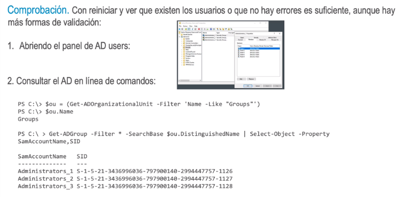

- Creación de OU. El primer paso consiste en crear la unidad organizativa que contendrá las cuentas del
  grupo. El cmdlet New-ADOrganizationalUnit requiere un tipo de objeto PSCredential para la contraseña
  diferente a los del anterior script.
- >  *crear la unidad organizativa
  $credencial = New-Object
  System.Management.Automation.PSCredential("$netbios\Administrator",
  $PassSeguraAdmin)
  New-ADOrganizationalUnit -Credential $credencial -Name Groups *
  -Path "DC=$netbios,DC=$suffix"
-
- Creación de usuarios. El bloque del bucle, un do-while, inicializa muchos parámetros de la cuenta del
  usuario a partir de una variable índice.
- > * crear 5 usuarios de prueba
  $а = 1
  Do
  {
  "Creando el usuario de pruebas: Tester_$a"
  New-ADUser -Credential $credencial -Name Tester-$a *
  -Path "CN=Users,DC=$netbios,DC=$suffix"
  -SamAccountName admin-tester-$a '
  -GivenName Tester-$a -SurName Test-Tested-$a '
  -AccountPassword $PassSeguraUser -Description Testing-User-$a '
  -UserPrincipalName admin-tester-$a@$Dominio •
  -DisplayName Tester-Test-Tested-$a
  -PasswordNeverExpires $false -Enabled $true
  $a++
  } While ($a -le 5)
- Creación de grupos. Dos bucles anidados: el externo crea los grupos y el interno añade todos los usuario como miembros del grupo.
- > * crear 3 grupos y añadir todos los usuarios a todos los grupos
  $g = 1
  Do
  1
  New-AGroupScope dotal Scredencial - Name "Administrators 5g* *
  -Path "OU=Groups,DC=$netbios,DC=$suffix" 2›&1 | out-null
  $a = 1
  DO
  {
  
  "Agregando el usuario Tester_$a al grupo Administrators_$g"
- > Add-ADGroupMember -Credential $credencial '
  -identity "CN=Administrators]
  _§g,OU=Groups,DC=$netbios,DC=$suffix" •
  -Members "CN=Tester-$a,CN=Users,DC=$netbios,DC=$suffix" 2›&1 | out-null
  $a++
  } While ($a -le 5)
  $g++
  } While ($g -le 3)
- Tanto este bloque como el anterior incluyen cadenas de texto sin un cmdlet a la vista. El  comportamiento de PowerShell es escribir estos datos por la salida estándar, de manera similar a volcarlos con Write-Host.
- 
-