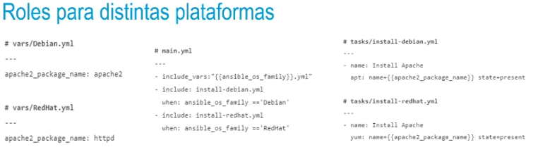

- 
- ## Trucos para escribir roles
  • Al crear un rol, tratar de asegurar que es utilizable sin necesidad de aportar nada más. Si tu
  rol instala un paquete específico de software, haz que se instale y configure una instalación
  básica sin intervención de usuario.
  Proporciona puntos de extensión para los usuarios que quieran personalizar cosas más
  tarde, pero no les hagas proporcionar información de entrada. Utiliza defaults/main. yml
  para esto, ya que puede ser fácilmente sobrescrito.
  • Escribe un rol sencillo que haga exactamente lo que debe hacer.
- •Hay dos clases de roles: rígidos y flexibles. Generalmente encontramos roles flexibles en
  Ansible Galaxy, que han sido diseñados para ser reutilizados. Soportarán muchas variables
  diferentes y te dejarán usarlos como necesites.
  • Cuando escribas roles tú mismo o los encuentres en un escenario concreto (de un cliente,
  por ejemplo) verás que son completamente rígidos.
  • Estos roles son específicos para un cliente, una aplicación particular.
  Estos roles no necesitan puntos de extensión, por lo que, en vez de usar variables, se tiende
  a establecer los valores directamente en el rol.
  • Se busca principalmente codificar los requisitos y no tanto el hacer un rol reutilizable