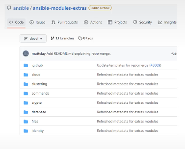

## Módulos en Ansible
• Los módulos, también denominados plugins de tareas (o plugins de biblioteca), son
fragmentos de código que se pueden usar desde la línea de comandos o desde una tarea
de un playbook.
• Ansible ejecuta cada módulo habitualmente en el nodo remoto destino de la ejecución y
recolecta los valores de retorno.
• Existen módulos disponibles en Ansible para las tareas más comunes de administración
del sistema.
• Podemos escribir nuestro propio módulo (en Bash o Python) y extender así la funcionalidad existente.
• ansible-modules-core. Contiene todos los módulos básicos que se proporcionan con
Ansible, tales como apt, template y copy, y es mantenido por el equipo principal de Ansible.
Estos módulos son robustos y sufren importantes revisiones antes de incorporar cualquier nuevo
cambio.
- ## ¿Cuándo implementar un módulo?
  No es una tarea fácil decidir si crear un rol o escribir un módulo. Si necesitas realizar varios
  pasos relacionados pero que no necesitan o requieren realizar peticiones complejas a
  servicios externos, entonces un rol es la decisión adecuada.
  Un buen ejemplo de esto sería el de crear una base de datos, configurar los usuarios e
  importar un archivo SQL de ejemplo.
- {:height 336, :width 427}
- Si necesitas interactuar con una fuente de datos externa, como una API, entonces un
  módulo es la mejor opción, ya que tienes a tu disposición toda la potencia de un lenguaje de
  programación, en lugar de utilizar el módulo de comandos y curl.
  Los módulos suelen estar diseñados para un cometido más concreto, aceptando una serie
  de variables que pueden utilizarse para configurar su comportamiento y permitir flexibilidad y
  reutilización.
-