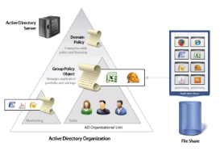
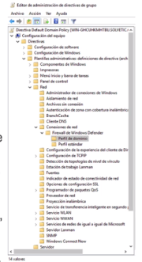
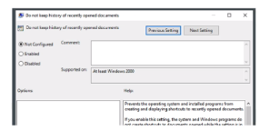

- • Las directivas de grupo o GPO (group policy object) están diseñadas para proporcionar a los administradores del sistema la capacidad de personalizar la configuración del usuario final y establecer restricciones sobre los tipos de acciones que los usuarios pueden realizar.
  • Se pueden crear directivas de grupo y aplicarlas a uno o más usuarios, servidores o equipos dentro del entorno.
  • Estas modificaciones suelen afectar al registro de Windows, por lo que es más fácil realizar estos cambios mediate directivas.
- {:height 237, :width 313}
- Funcionamiento de las directivas de grupo
  • La configuración se basa en las plantillas administrativas de la directiva de grupo.
  • Estas plantillas proporcionan una lista de opciones de configuración.
  • Una vez que se configura una de esas opciones, se realiza el cambio en el registro de Windows de las sesiones de los usuarios y equipos a los que aplica la directiva.
  • Windows viene con varias plantillas administrativas, y ademas los admins y desarrolladores pueden
  crear sus propios archivos de plantilla.
- 
- • Enabled: indica que se ha establecido una configuración para esta GPO.
  * Disabled: indica que esta opción está desactivada (el admin no quiere permitir esta función
  • Not configured: no está no habilitado ni deshabilitado, simplemente sin configurar.
- 
-
- La configuración de la directiva de grupo puede aplicarse a dos tipos de objetos:
  usuarios y equipos, tanto locales como de Directorio Activo. Estos pueden a su vez
  organizarse en OU y la configuración de la directiva aplicaría directamente a la OU.
- • Configuración de software: se aplican a aplicaciones y software específicos que pueden instalarse en los equipos.
  Sirve para hacer que las nuevas aplicaciones estén disponibles para los usuarios y controlar su configuración.
  • Configuración de Windows: sirve para configurar el SO:
  configurar Internet Explorer, registro de eventos, etc.
  • Plantillas administrativas:
  sirven para personalizar aún más las configuraciones de usuario y equipo. Se pueden crear plantillas nuevas y customizarlas.
-
- ### Configurar las directivas
  • Por facilidad y eficiencia, las directivas de grupo se agrupan en objetos de directiva de grupo o GPO.
  • Las GPO son como contenedores de directivas. Se puede granularizar en departamentos, áreas, perfiles, etc.
  • La configuración de la directiva de grupo es jerárquica. Hay cuatro niveles que determinan la prioridad de procesamiento de GPO:
  • Local. Cada equipo tiene un objeto de directiva de grupo que se almacena localmente.
  • Sitios. La configuración de GPO de un sitio se aplica a todos los dominios y servidores que forman
  parte de este.
  • Dominios. La configuración de GPO ubicada en el nivel de dominio se aplicará a todos los objetos de usuario y equipo dentro del dominio.
  • Unidades organizativas (OU). Es el nivel de configuración más granular.
  Si la estructura de OU está bien planificada, resultará fácil hacer asignaciones lógicas de GPO a departamentos o unidades de negocio.
- ### Herencia de GPO
  • La configuración de las directivas de grupo es acumulativa.
  • Puede haber una configuración a nivel de dominio y una GPO en nivel de OU, y se aplicarían ambas.
  • Si existe contradicciones (conflictos en la configuración), se aplicaría la configuracion en el más
  específico, ya que estas anulan a las de niveles más generales.
  • Las directivas de los GPO se aplican en el orden del listado anterior (locales, sitio, dominio y OU).
- Por defecto, la configuración es acumulativa y heredada, pero esto se puede modificar con dos opciones:
  •Bloqueo de herencia: especifica que las directivas de grupo para un objeto contenedor no se heredan de los contenedores superiores.
  • Forzar herencia de directivas: de esta forma, se garantiza que todos los objetos de nivel inferior
  heredan estas configuraciones.
  Si existe un conflicto entre la directiva aplicada a un equipo y a un usuario, prevalece la configuración del usuario (los objetos de usuario y de equipo no tienen por qué pertenecer a la misma OU y, por tanto, pueden recibir configuraciones diferentes).