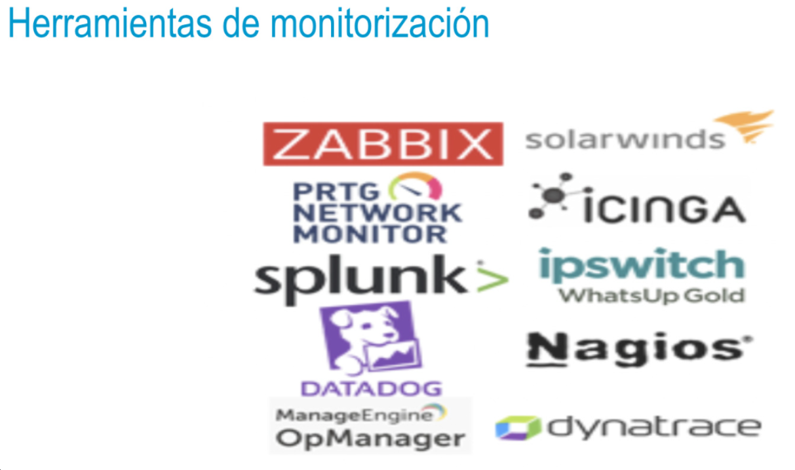
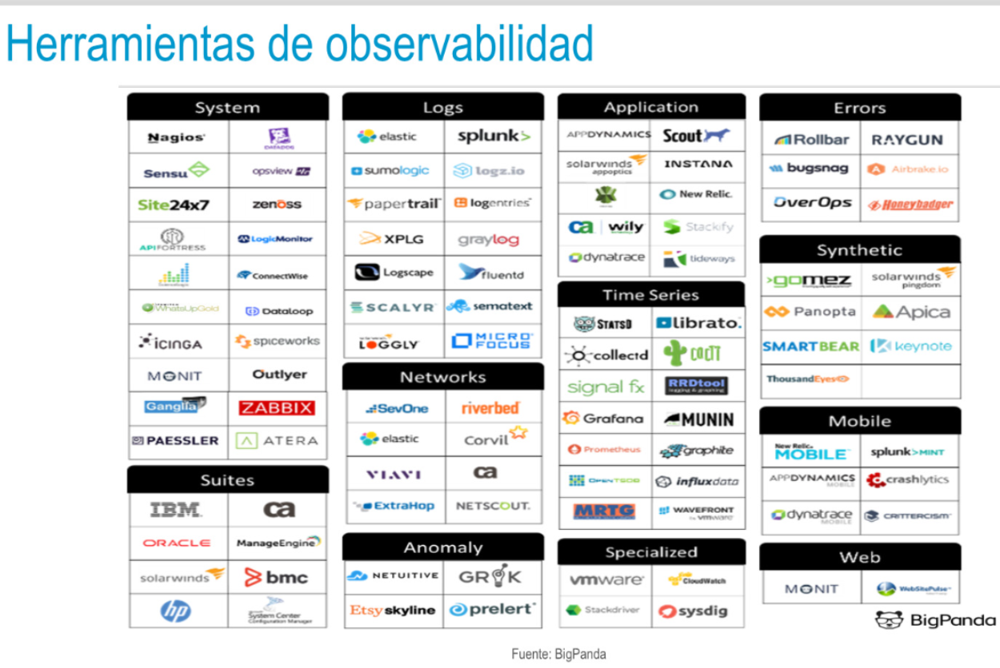

- 
- 
- ### Objetivos de la observabilidad
  • Conocer en tiempo real el estado de los diferentes ecosistemas.
  • Reducir los tiempos de resolución de incidencias.
  • Resolver los problemas de forma más rápida y dedicando menos recursos.
  • Aportar cuadros de mando de alto y bajo nivel a diferentes departamentos de la empresa.
  • Cuadro de mando unificado.
  • Capacidad de correlación de información proveniente de distintas fuentes.
-