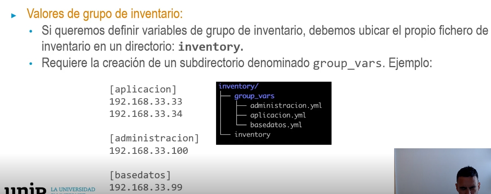

## Variables en Ansible
• Las variables en Ansible se pueden usar en playbooks o en plantillas.
• Se pueden utilizar para el contenido (una plantilla de fichero de configuración, lista de
paquetes para instalar en una tarea) o para controlar el flujo de ejecución, como una
manera de decidir qué acciones realizará tu playbook (condicionando las tareas al
valor de la variable).
• Son siempre globales, por eso están disponibles para todos los playbooks y plantillas
en tiempo de procesamiento.
• Por este motivo las variables de un rol se prefijan con el
nombre del rol.
- > hosts: all
  become: true
  roles:
- > role: ansibleunir.wordpress
  dobles: {{variable_nam
  Ansible utiliza Jinja2 como |
  permite disponer no solo de
  sino de toda la funcionalid
  vars:
  nombre_bd: mywordpressdb
  usuario_bd: mywordpressusr
  password_bd: Aproba2to2
  dominio_wp: book.example.com
  titulo_inicial: Hola hola a todos
  contenido_inicial: Ejemplo de contenido inicial. Que vaya todo bien!
- ## Ubicación de variables
  Las variables de Ansible se pueden definir en una infinidad de lugares diferentes.
  En la documentación de Ansible se pueden encontrar esas ubicaciones junto con su precedencia
  para saber qué ubicaciones sobrescriben un valor previo.
  *Estos lugares están ordenados de menor a mayor precedencia → los valores por defecto en los
  roles tienen la precedencia más bajo.
  * Las variables de grupo de inventario sobrescriben los valores predeterminados de roles, pero son
  sobrescritos por el módulo set_fact.
- Valores por defecto:
  • Se definen en el archivo defaults/main.yml dentro del rol.
  • Tienen la precedencia más baja.
  > nombre_usuario: Caracola
- Valores de inventario:
  • Solo estarán disponibles para el host en la que se defina.
  192.168.33.33 nombre_usuario=Caracola
  [aplicacion]
  192.168.33.33
  192.168.33.34
  [aplicacion:vars]
  nombre_usuario=Caracola
  [sitiosweb: child
  ren]
  aplicacion
  administracion
  [sitiosweb: vars]
  Version_php: 7
-
- 
-
- 
- Valores de grupo de playbook:
  • Otra ubicación donde se pueden definir variables de grupo es en el subdirectorio
  group_vars, pero situado a nivel de playbook.
  • Su funcionalidad es la misma que las definidas a nivel inventario, pero esta vez el
  subdirectorio cuelga del mismo directorio en el que se encuentra el fichero
  playbook. ym], y su precedencia es también superior.