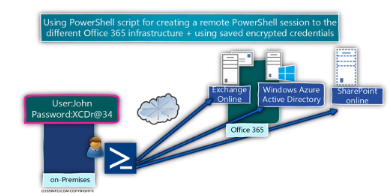

- • PowerShell se puede usar como una herramienta de administración remota.
  • Los pasos serían:
  1. Configurar un servidor para que acepte conexiones remotas de PowerShell.
  2. Conectarse a ese servidor para obtener información y hacer cambios.
- {:height 287, :width 521}
- ### 1. Preparar el servidor remoto
  • Es necesario revisar algunos elementos para que los servidores sean capaces de aceptar sesiones de PowerShell.
  • Es probable que ya esté todo habilitado (por defecto desde W2012), pero podría haberse deshabilitado por política o manualmente.
  • El servicio winM: es parte de la admin remota de Windows Server. Se puede verificar que se está
  ejecutando (desde la consola de services.msc o ejecutando Get-Service WinRM.
  • Enable-PSRemoting - Force: configura el sistema para aceptar conexiones remotas y crear una
  regla de firewall en el sistema para permitir este tráfico.
  • Habilitar conexiones desde otros dominios o grupos de trabajo. Si las máquinas están en el mismo dominio, confían automaticamente entre si. En caso contrario, hay que configurar el equipo para que
  confíe en el equipo remoto que se va a conectar.
- > Set-Item wsman: \localhost \client\ Trustedhosts host origen
- #### 2. Conexión al servidor remoto
  • Hay dos opciones para usar PowerShell de forma remota:
  1. Ejecutar cada comando en el sistema remoto de manera individual. Esta forma implica usar el parámetro-ComputerName. Esto especifica que el comando se va a ejecutar en el sistema remoto especificado.
- > Get-Service schedule -ComputerName server1
- 2. Abrir una sesión de PowerShell interactiva (similar a SSH en Linux). Con Enter-PSSession se inicia una sesión y la línea de comandos pasa a ser la shell del equipo remoto. Los codlets se ejecutarán en esa shell con su propio entorno y variables.
- > Enter-PSSession -ComputerName server1
- • Si la cuenta de usuario del equipo es diferente de la cuenta del equipo remoto, el parámetro - Credential sirve para indicar la cuenta de usuario.
- > Enter-PSSession -ComputerName server1 -Credential USERNAME