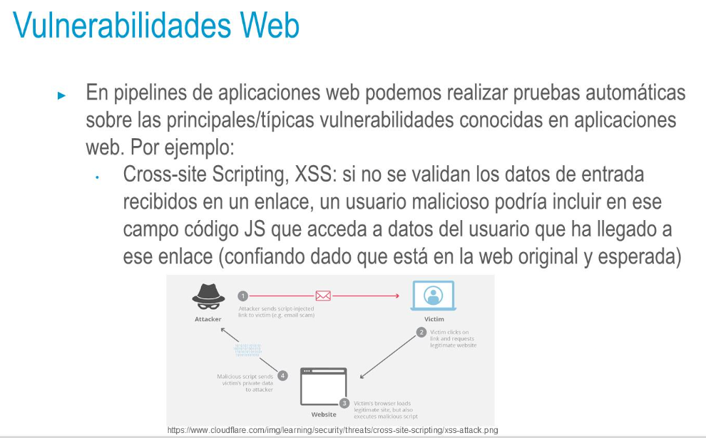

- 
- 
- 
- 
-
- **Autenticación**
  • Realizar pruebas en aplicaciones que precisan de autenticación
  • Contraseñas de usuario enviadas con cifrado no reversible (hash) → No
  envío de contraseñas en plano
  • Utilización de protocolos de identidad → Single Sign-On
  • Se confía en una tercera parte para identificar al usuario
  • Frameworks → Selenium, Taiko, etc.
  • ¿Comprobar si un recurso es accesible sin autenticación?
- **Dependencias**
  • Fijar estáticamente las versiones de las librerías utilizadas
  • Esto puede hacer que determinadas vulnerabilidades de seguridad de
  esas librerías no se actualicen debidamente en nuestra aplicación en
  producción
  • Se recomienda un correcto sistema de actualización de dependencias
  • Es buena praxis en el desarrollo de una librería la compatibilidad hacia
  atrás para permitir sistemas de actualización de dependencias
  automáticas para con los usuarios de nuestra librería
- **HTTPS**
  • HTTPS certifica:
  • Confidencialidad
  • Integridad
  • Autenticación
  • Inhabilitar peticiones HTTP
  • De vital importancia no sólo en aplicaciones que sirven webs, sino que
  también en aquellas que proporcionan servicios API REST
  • Uso y mantenimiento correcto de los certificados