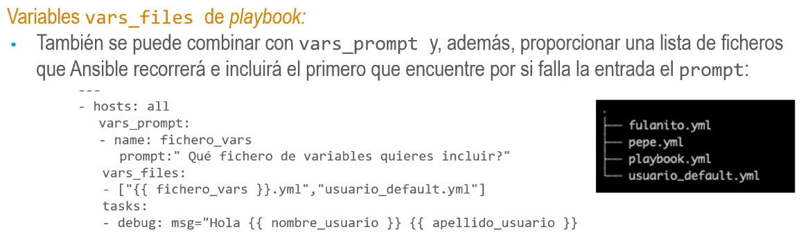
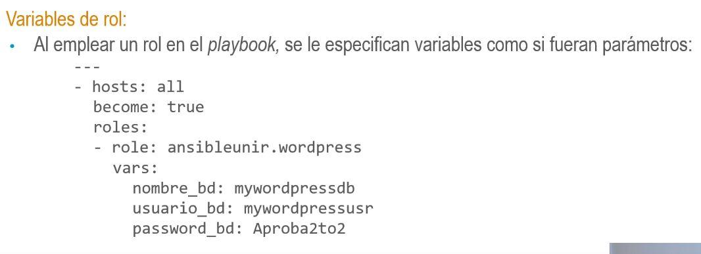

## Ubicación de variables
• Facts de host:
• Un fact corresponde a un dato de la máquina que se está gestionando.
• Los facts (IP, sistema operativo, etc.) están disponibles como variables en Ansible, con la misma
funcionalidad que cualquier otra variable.
• Al ejecutar Ansible, el primer módulo que se procesa es el de configuración (setup), el cual es el
encargado de recopilar los facts de la máquina que se gestiona.
• Si definimos facts con los mismos nombres que los valores predeterminados de roles o las
variables de grupo o de host, se sobrescribirán con los facts de la máquina.
- ### Facts de host:
  • Si por el contrario, lo que hacemos es registrar una variable mediante la opción register o
  utilizar el módulo set_fact asignando el valor a un nombre que coincida con el fact de host,
  este último quedará sobrescrito.
  • ansible_all_ipv4_addresses: ejemplo de fact de host. Contiene una lista con todas las
  direcciones IP versión 4 de la máquina.
- > ansible all -i fichero_de_inventario -m setup
  ansible Localhost -m setup (para conocer los facts de la máquina local).
- ### Variables registradas:
  • Se puede guardar la salida de los módulos para usarla más adelante. Ej.: almacenar en la
  variable hosts_info toda la información del sistema de archivos sobre el fichero
  > /etc/hosts:
- > stat: path=/etc/hosts (el comando stat muestra por pantalla atributos de un archivo).
  register: hosts_info
- > debug: var=hosts_info
- • En caso de que la variable hosts_info estuviera definida en cualquier otra ubicación con
  una precedencia más baja que la de las variables registradas se
  sobrescribiría su valor.
- ### Facts definidos:
  • Son facts que pueden ser definidos por el usuario en un playbook usando el módulo set_fact.
  Ej.: fact con nombre ejemplo_fact:
- > hosts: all
  tasks:
- >set_fact: ejemplo_fact="Hola mundo"
- >debug: var= ejemplo_fact
- ### Variables de playbook:
  • Variables directamente en un playbook en la sección vars:
- >hosts: all
  gather_facts: false
  vars:
  nombre_usuario: Caracola
  tasks:
- >debug: msg="Hello {{nombre_usuario}}"
- ### Variables vars_prompt de playbook:
  Obtener información por el usuario en tiempo de ejecución especificando una sección
  vars_prompt en el playbook.
  • Ansible mostrará la pregunta especificada y almacenará la respuesta como valor de la variable:
- >hosts: all
  vars_prompt:
- >name: nombre_usuario
  prompt: write the user name
  private: false
  tasks:
- >debug: msg="Hola {{nombre_usuario}}"
- ### Variables vars_files de playbook:
  • Especificar ficheros de variables:
- >hosts: all
  vars_files:
- >mas
  _variables.yml
  tasks:
- >debug: msg="Hola {{ nombre_usuario }} {{ apellido_usuario }}"
- ### Variables vars_files de playbook:
  • También se pueden usar valores de otras variables. Ej.: selección dinámica de un fichero según
  sea Redhat o Debian.
- >hosts: all
  vars_files:
  -"{fansible_os_family}}-ym1"
- 
- 