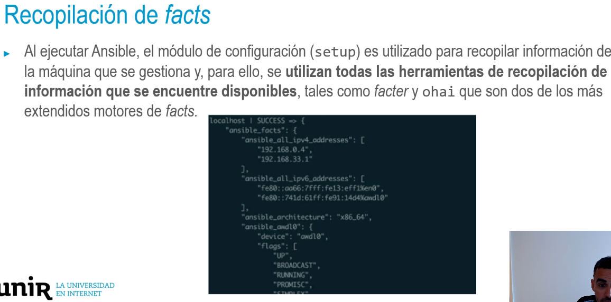

- 
- La respuesta consiste en un diccionario llamado ansible_facts.
  Acceso a dato específico: ansible_facts['ansible_architecture'].
  Una variable de fact interesante es ansible_env, donde están todas las variables de
  entorno definidas en el host destino.
  Ejecutar el módulo de configuración manualmente mediante:
  > ansible all -i fichero_inventario -m setup
- **Deshabilitacion de facts:**
  • Para ahorrar tiempo de procesamiento al obtener los facts se pueden deshabilitar si no se
  necesitan:
- hosts: all
  gather_facts: false
  tasks:
- debug: msg="Hola Pepe"
- ## Facts.d:
  • Crear facts locales en la propia máquina que ejecuta Ansible → se leerán todos los ficheros con
  extensión *. fact en el directorio / etc/ansible/facts.d y los hará accesible como variables
  para el playbook bajo la clave ansible_local.
  • Ejemplo de /etc/ansible/facts.d/users. fact con el siguiente contenido:
  > [pepe]
  usar_colores=1
  sudo_sin_password=0
- • Para acceder a usar
  _colores, la ruta sería:
  > ansible_local.users.pepe.usar
  _colores
- ## Cacheo de facts:
  • Empleado para acelerar las ejecuciones al usar facts.
  • Se habilita en el fichero de configuración de Ansible: ansible.cfg.
  • Ejemplo: mecanismo inteligente que hace que se compruebe la caché antes de volver a
  recopilarlos, emplear JSON y el tiempo es válido en la caché durante 10h.
  > [defaults]
  gathering = smart
  fact_caching = jsonfile
  fact_caching_connection = /directorio/cache
  fact caching timeout = 36000
- ### Recopilación de facts
  • **Hostvars:**
  • El diccionario **hostvars** proporciona acceso a información de los hosts diferentes a la máquina
  actual. Ejemplo: conocer la IP privada de la máquina de la base de datos accediendo por su
  nombre de host de inventario:
  >hostvars["basedatos.dominio.es']['ansible_eth0"]['ipv4']['address']
- • **Solo** se puede consultar la información de los host que se hayan visitado previamente.
  • Para obtener información de todas las máquinas: habilitar la caché de facts y ejecutar un playbook
  con la periodicidad requerida para recopilar los facts de cada máquina.
- **Manipulación de variables**
  • Jinja2 es el **encargado de la sustitución** y manejo de variables en Ansible como motor de
  plantillas mediante la { {sintaxis_doble_llave}}.
  • Ofrece más funcionalidades como herramientas de manipulación de datos llamadas filtros.
  https://jinja.palletsprojects.com/en/3.0.x/templates/#builtin-filters
  • Ejemplos de gran utilizad a la hora de manipular los valores de las variables de Ansible: map,
  replace, rejectattr, selectattr, list, first y last.
- Manipulación de variables
  • Ejemplo: generar cuentas de usuario de los empleados del departamento de informática:
- hosts: all
  vars:
  empleados:
- nombre: Pepe departamento: Informatica
- nombre: Luis departamento: Informatica
- nombre: Paco departamento: Finanzas
  tasks:
- > user: name="{{item.nombre}}" groups=developers append=yes
  100p:
  "{{empleados | selectattr ('departamento', 'equalto', 'Informatica') | list}}"
- Importante **separar la lógica** (playbooks) de los datos (mediante variables).
  Permitiría cambiar de herramienta de gestión manteniendo los datos o incluso generar
  automáticamente los datos accediendo a una base de datos.
  Muy útil al gestionar la infraestructura como código.
- ### Filosofía de variables de Ansible
  • Ansible recomienda como buena práctica el **definir cada variable una sola vez**, siempre que
  sea posible.
  • Se trata de **determinar en qué ubicación** se debería declarar la variable para **evitar** tener que
  sobrescribir posteriormente.
  • Puede haber excepciones a esta regla, como puede ser la definición de valores por defecto en
  un rol.
  • En la mayor parte de las ocasiones lo más adecuado será declararlas en una de las **ubicaciones
  más habituales.**
-
-