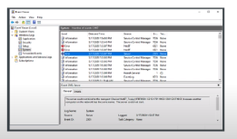
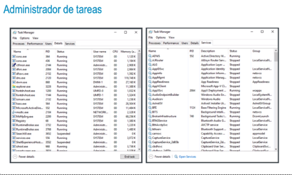
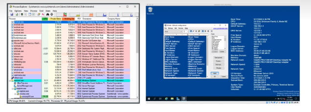
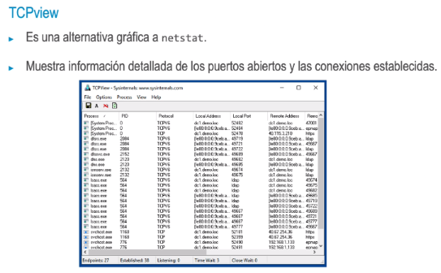

### Visor de eventos
• Es el visor de logs de Windows. Los eventos están categorizados en función de su origen, por lo que
encontrar un evento concreto requiere revisar varias carpetas.
• Se basa en la consola MMC, por lo que se puede acceder al visor desde otro equipo sin necesidad de iniciar una sesión por RDP.
- Los eventos precedidos por un icono azul son informativos, los amarillos indican una advertencia
  y los rojos son errores. De alguna manera, equivalen a los niveles de los tradicionales de INFO,
  WARNING Y ERROR.
- {:height 268, :width 417}
- ### Administrador de tareas
  * Es una herramienta que siempre ha existido en los sistemas operativos Windows.
  • Se invoca presionando Ctr] + Alt + Supr en el teclado y luego haciendo clic en administrador de
  tareas o clic derecho en la barra de tareas y luego seleccionando administrador de tareas. También se
  puede iniciar con ctrl + Shift + Esc o escribiendo taskmgr en el cuadro de diálogo Ejecutar.
  • Destacan las pestañas «detalles» y «servicios» para administrar procesos. «Detalles» muestra qué
  aplicaciones se están ejecutando actualmente en el sistema. Se puede obtener información como el PID, el usuario que la ha iniciado, la llamada de línea de comandos, el uso de CPU y memoria, etc. Además, es posible detener la ejecución de un proceso con el menú contextual. Similar a top en Linux.
  > «Servicios» muestra el estado de estos y permite arrancarlos, pararlos, etc.
-
-
- 
- ### Programador de tareas
  • Permite programar tareas administrativas para que se ejecuten automáticamente.
  • Es, en cierta medida, equivalente a cron.
  • Al igual que el visor de eventos, el programador de tareas es un snapin de la consola MMC.
  • Las tareas pueden ser llamadas a ejecutables o scripts, por lo que se puede programar cualquier tarea automatizable. Los desencadenantes, o triggers, pueden ser desde una hora concreta hasta un inicio de sesión, el arranque del equipo, un evento, un bloqueo de pantalla, etc.
- ### Sysinternals
  • Ofrece multitud de herramientas de diagnóstico para Windows. Complementa notablemente las
  herramientas de un Windows recién instalado.
  • PsExec es una herramienta de línea de comandos que permite ejecutar acciones y scripts en máquinas remotas. Hasta el desarrollo de PowerShell, esto era especialmente útil.
  • Process Explorer viene a ser el sustituto del administrador de tareas, ofrece mucha más información de cada proceso y puede mostrar los procesos en orden jerárquico.
  • Bginfo se ejecuta en cada inicio de sesión y personaliza el fondo de pantalla con un bloque de texto. Se usa típicamente para mostrar información básica del equipo, como nombre de host, espacio libre en disco, dirección IP, etc.
- {:height 257, :width 800}
-
-
- {:height 392, :width 580}
-