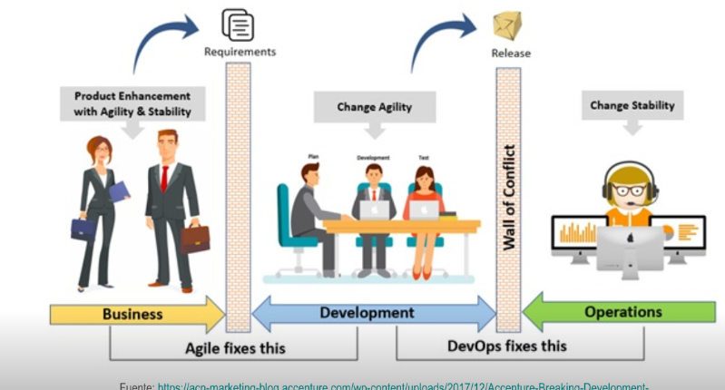
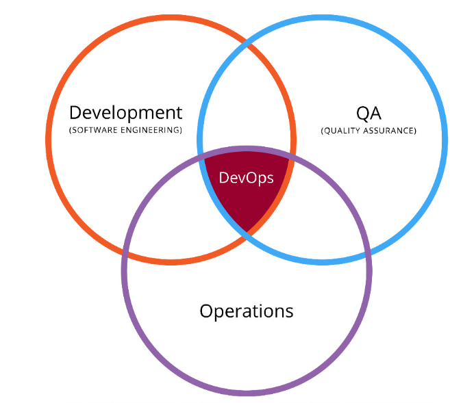

- Es necesario pasar del control al autoservicio, del miedo a la visibilidad, de los silos a la colaboración
  abierta, y ninguno de estos cambios se puede imponer; de un cambio organizativo muy beneficioso a la vez que radical.
- 
-
- 
-