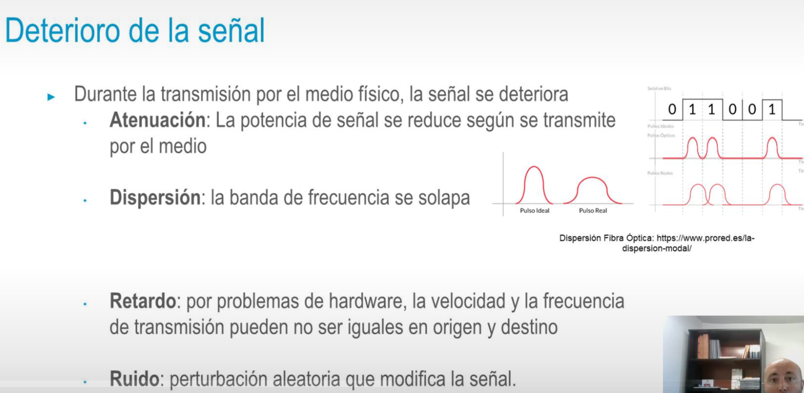

- 
- ## Capa física
  • ¿Cómo trabaja el hardware de red?
  • Conectividad física entre dos dispositivos
  • Capa de enlace pasa tramas a la capa física, que se encargará de:
  • Convertir en pulsos eléctricos → Cable de cobre
  • Convertir en señales electromagnéticas → Red inalámbrica
  • Convertir en pulsos de luz → Fibra óptica la conexión física es transparente para la capa de enlace
- 
- ## Medios de transmisión
  • Guiados → Cable
  • Dos dispositivos → Punto a punto
  • N dispositivos → Bus
- **No guiados** → Sin material físico
  • Cualquier dispositivo puede ser receptor si está dentro del alcance
-