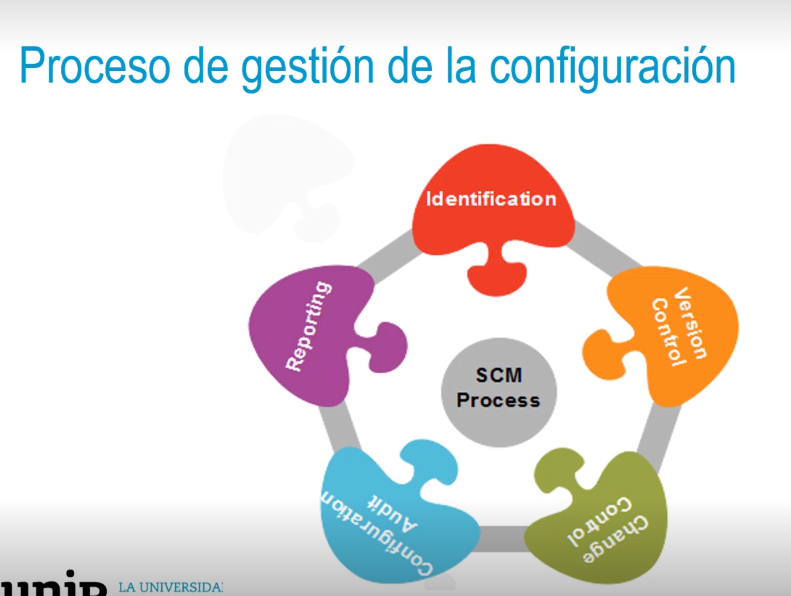
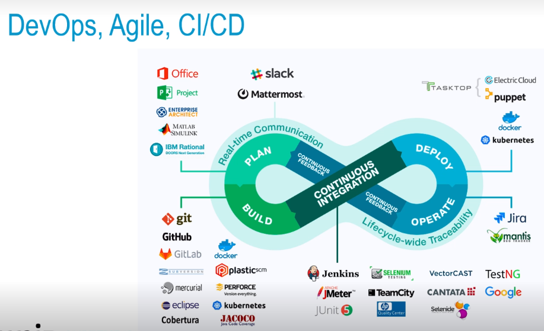
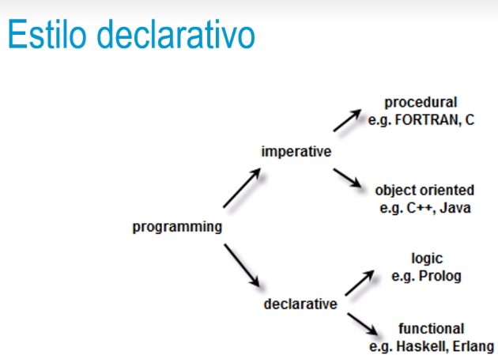

- Indice
  • ¿Qué son los SGC?
  • Proceso de gestión de la configuración.
  • DevOps, Agile, CI/CD.
  • .Estilo declarativo.
  • Herramientas
- ¿Qué son los SGC?
  • Definición: es un proceso.
  • Origen: US Army.
  • Estandares:
  • ISO 20000:1 2011& 2018 Service Management System.
  • ITIL Service Asset and Configuration Management.
  • Beneficios:
  • Escalado mas sencillo.
  • Disaster recovery.
  • Uptime.
-
- 
-
-
- 
-
-
- 
-